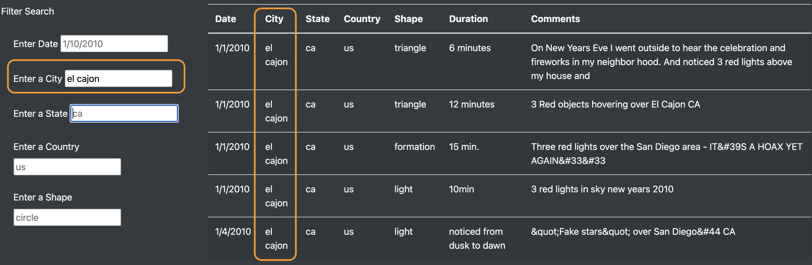

# UFOs
Bootcamp Mod 11

## Overview
This project was designed to provide data on UFO sitings in 2010 in a filterable table. Utilizing JavaScript, visitors to the site can enter information in the input fields (on the bottom left of the index page) in order to filter the table (on the bottom right of the index page). By default, all available information can be found in the table when the page is first loaded. The filter may include multiple inputs and will filter after each additional piece of information is entered by a user, returning all rows of data that match all the input thus far entered by the user.  

The html page was constructed using bootstrap in order to streamline the process and create a quick and simple index page. There is very light additional style editing via a CSS page, primarily changing the background color of the page. The real force behind this simple page is the app.js file that contains several functions. First to build the table, then to listen for user feedback and filter the table according to that feedback.  

### Resources
* index.html: html, css, js, bootstrap, d3  
* style.css: image from nasa  
* data.js: json data (provided)
* app.js: d3. 

## Results
The index page is very clean and crisp, thanks to using Bootstrap's grid system. The header takes up the entire width of the page, whereas the next row is split into two columns, with an article title covering one-third of the width, and the article's blurb, which covers the remaining two-thirds of the width of the page. The next row is the heart of the webpage, with a series of input boxes for user input, covering one-quarter of the width, and the filterable table covering the reaminig three-quarters of the width of the page.  

  

The table is first displayed with all the data in the background data file. Upon receiving input the user, the table is filtered based upon the received input. For example, if a single criterion is inputted, the table will return results matching the received input.  

  

Upon entering input in a second input field, the table will filter the data based on both inputs thus far entered.  

  

Similarly, further input would filter the table even further should such data exist.  If all inputs are cleared, the entire dataset is presented again in the table.  

  

## Summary
lorem ipsum  
