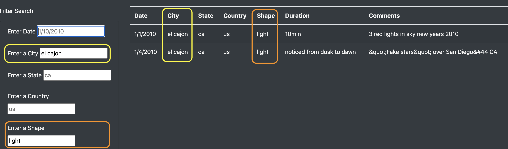

# UFOs
Bootcamp Mod 11

## Overview
This project was designed to provide data on UFO sightings in 2010 in a filterable table. Utilizing JavaScript, visitors to the website can enter information in the input fields (on the bottom left of the index page) in order to filter the table (on the bottom right of the index page). By default, all available information can be found in the table when the page is first loaded. The filter may include multiple inputs and will filter after each additional piece of information is entered by a user, returning all rows of data that match all the input thus far entered by the user.  

The html page was constructed using bootstrap in order to streamline the process and create a quick and simple index page. There is very light additional style editing via a CSS page, primarily changing the background color of the page. The real force behind this simple page is the app.js file that contains several functions. First to build the table, then to listen for user feedback and filter the table according to that feedback.  

### Resources
* index.html: html, css, js, bootstrap, d3  
* style.css: image from nasa  
* data.js: json data (provided)
* app.js: d3. 

## Results
The index page is very clean and crisp, thanks to using Bootstrap's grid system. The header takes up the entire width of the page, whereas the next row is split into two columns, with an article title covering one-third of the width, and the article's blurb, which covers the remaining two-thirds of the width of the page. The next row is the heart of the webpage, with a series of input boxes for user input, covering one-quarter of the width, and the filterable table covering the reaminig three-quarters of the width of the page.  

 
The table is first displayed with all the data in the background data file. Upon receiving input the user, the table is filtered based upon the received input. For example, if a single criterion is inputted, the table will return results matching the received input.  

Upon entering input in a second input field, the table will filter the data based on both inputs thus far entered.  

Similarly, further input would filter the table even further should such data exist.  If all inputs are cleared, the entire dataset is presented again in the table.  

 

## Summary
The implementation of this website works quite well according to the initial concept. The page looks good and the table presentation and filtered work as expected and hoped-for. To this point, all of the objectives for this project have been successfully fulfilled.  

Two drawbacks that immediately present themselves are: 1) the article and blurb featured just below the headline of the site are static. They do not change. Perhaps this is the currently intended design, but it does not provide a reason to return to the site. This could improve by scraping an article title and blurb from an appropriate website so that this information would not be static, or a rotating series of static tites/blurbs could be written and rotated via a slideshow or similar mechanism. 2) the data is extremely limited. There are only thirteen days worth of UFO sightings are available in the data. For there to be any value for end users, an exponential increase in the data available would need to be used. This, however, would require an alteration in the initial presentation of the data table. If there were thousands of days of data and no change to the initial table builder were made, the table would be very long and conceivably could affect loading times. Neither would improve the website's usability. Thus, there would need to be some initial filter placed on the data for the table's first build.  

Two key recommendations for the improvement of the website would be as follows:
1. Increase the amount of data available to be search. This would require, as discussed above, a few changes in the initial presentation of the table build. With enough data, perhaps the default data could include any UFO sightings that occurred on the current day of the year, or nearest day if no data matches the current date.  
2. For an improved user experience, several related improvements could be made regarding the search feature:
    * There should be a clear filter button below all of the input fields that clears all of the fields. This is not necessarily from a technical standpoint, but would provide the user with a clear sense of how to accomplish resetting the data. For users with less technical ability, this would considerably improve the usability of the search.
    * It could prove helpful if the placeholder text of input fields not used by the user would clear the placeholder text. This would clearly indicate which field had received input and which had not.
    * The shape input field would be more helpful as a dropdown box offering the possibilities, rather than a simple text input box.
